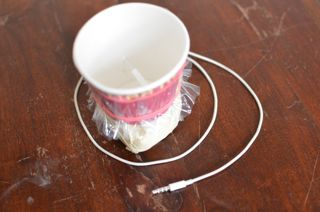

# How to explore your heartbeat 

A few months ago, I bought a really cool book: [Exploring Everyday Things (with R and Ruby)](http://shop.oreilly.com/product/0636920022626.do). I learned many interesting and mostly useless things from the author, Sau Sheong Chang. Chapter 6 for example explains how to build a **stethoscope** with nothing more than

* a paper cup,
* a foil,
* an elastic band and
* iphone-earplugs.

I took a day off yesterday. This was a good opportunity to realize this little project. I also needed to gain experience with [Knitr](http://yihui.name/knitr/), a fantastic software to write reproducible reports (*like the one you're reading now*) in [Markdown](http://warpedvisions.org/projects/markdown-cheat-sheet/). If you're interested, you can find the source code and all necessary files for this complete blog-post [here](http://www.github.com). Last but not least, I re-wrote the original code (Ruby --> R). Why? Again: Practicing my [R](http://www.r-project.org)-skills...

## First step: Homemade stethoscope

Bevor I start, let me show you what I've done to record my heartbeat. It wasn't that easy as I thought it would be. The first picture shows my attempt to build the stethoscope. The earphones have a build-in microphone. I placed them inside the paper cup. Two little holes in the cup's side-walls were made to let through the cables.


You can see in the second picture, that I've used a lot of crepe tape. There's no need to... And, I must admit that it doesn't look very elegant. But, I don't care. The importent trick in recording a heartbeat is the membrane. Mine is made from a feezer bag and it is attached by two elastic bands.



## Second step: Record your heartbeat!

To record the heartbeat, I used an iphone-App called TwistedWave. You can try any other recording-software as far as it can save wav-files (mono). All my initial efforts to record my heartbeat were not successful. And no solution for these problems could be found in the book...!! I thought about this challenge an come up with an easy soulution: Sports! After running the stairs down to the frontdoor and back to the 4th floor I was able to record my heartbeat - because the heartbeat was louder then. I saved the **heartbeat.wav** in my working directory for further analysis.

## Third step: Extracting data from sound

The wav-file format is described on page 160 and the explanation of the utilized Ruby-code you can find on page 163. Buy the book. It's worth it! The following code is my R-version of the original Ruby-code. I make use of the [tuneR](http://cran.r-project.org/web/packages/tuneR/)-package.


```r
library(tuneR)
heartbeat <- readWave("heartbeat.wav", from = 55001, to = 275000, units = "samples")
print(heartbeat)
```

```
## 
## Wave Object
## 	Number of Samples:      220000
## 	Duration (seconds):     4.99
## 	Samplingrate (Hertz):   44100
## 	Channels (Mono/Stereo): Mono
## 	Bit (8/16/24/32):       16
```


My sound-files lasts 4.99 seconds. 220000 Samples have been recorded. Wow! Because of unwanted noises at the beginning and the end of heartbeat.wav, I sorted out samples above #55001 and under #275000 (see above).

## Fourth step: Visualizing your hertbeat

Because I recorded the heart sounds in mono, I plot the left channel (there is no right channel, because I recorded in mono). The following graph suggests, that my heart beats 10 times whithin the **5 seconds**-periode.


```r
plot(heartbeat@left, type = "n", main = "Channel 1 + Channel 2", xlab = "Time", 
    ylab = "Frequency")
lines(heartbeat@left)
```

 


I multiply the 10 beats with 12 to find my heart rate: `120` bpm! Sounds plausible.
